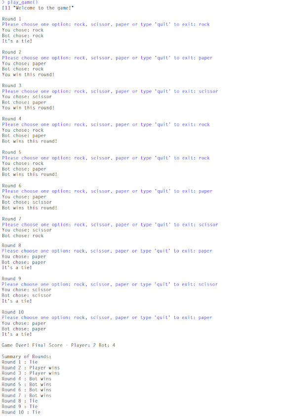

# 🪨✂️📄 Pao Ying Chub (เป่ายิ้งฉุบ) Game in R
A simple terminal-based game of Rock-Paper-Scissors written in R.  
Play against a bot for 10 rounds — or quit any time!

## 🎮 How to Play

1. Run the `pao_ying_chub.R` file in RStudio or an R console.
2. Choose between `rock`, `paper`, or `scissor` when prompted.
3. You can type `quit` to exit early.
4. The game keeps score and shows a round summary.

## 🛠 Features

- 10 rounds of gameplay (or quit early)
- Score tracking
- Round-by-round summary
- Fun and simple console output

## 📦 No packages required

This game uses only base R — just copy and play!

## 📸 Demo 

